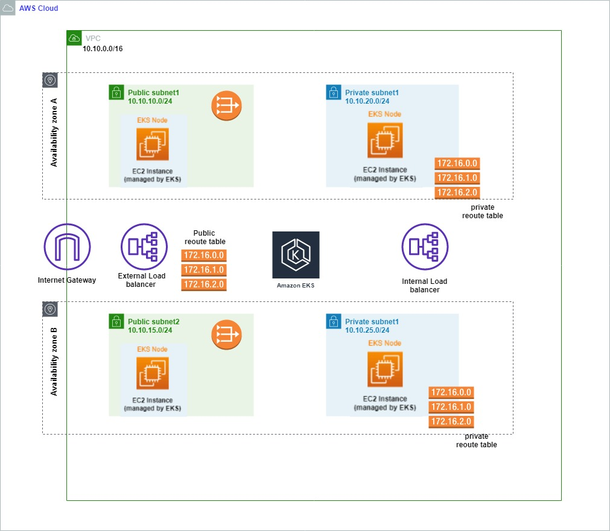

## Pre-requisites 

### Creating workstation 
Make sure that you are having a workstation with below packages
- git
- terraform
- python3
- pip3
- awscli
- kubectl


## Building Microserivce Platform - EKS:
→ make sure you are configuring aws cli before you start

```sh 
→ git clone https://github.com/Budhish/infra-eks-terraform.git
→ cd eks-infra-terraform
→ terraform init
→ terraform apply -auto-approve
```
Note: It take around 5-10 minutes to build the eks cluster
```sh
→ aws eks update-kubeconfig --name clustername --region ap-south-1 # update the kubeconfig 
```
##### EKS Architecture

